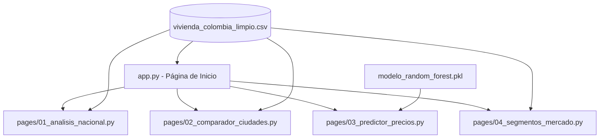

# Fase 6 — Despliegue
## Proyecto: Accesibilidad de Vivienda en Colombia · CRISP-DM 2025-I
**Responsable principal:** Kukis · **Apoyo:** Sofía  
**Estado:** ✅ Completa y lista para revisión del jurado  
**Semanas:** 10 – 11

---

## Introducción

La Fase 6 de la metodología CRISP-DM corresponde al Despliegue (Deployment). En esta etapa final, el equipo transforma los hallazgos y modelos analíticos de las fases previas en una herramienta de software interactiva y de fácil acceso para los usuarios finales. 

Para este proyecto, diseñamos e implementamos un **Dashboard Interactivo en Streamlit** que se despliega de manera pública en la nube. La aplicación integra:
- Visualizaciones dinámicas de la evolución temporal del Índice de Accesibilidad Habitacional (IAH).
- Módulos comparativos interactivos entre las 12 ciudades focalizadas.
- Acceso directo al pipeline del modelo predictivo Random Forest (Fase 4) para estimar precios de viviendas en tiempo real.
- Visualización de la segmentación no supervisada por clústeres.

---

## 1. Requerimientos del Dashboard

El desarrollo del dashboard se estructuró bajo una lista de 8 Requerimientos Funcionales (RF), todos implementados y validados por el área técnica:

| ID | Requerimiento Funcional | Descripción | Prioridad | Estado |
|---|---|---|---|---|
| **RF-01** | Panel de Indicadores Clave (KPI) | Mostrar métricas resumen nacionales y locales: precio mediano, IAH promedio y ratio cuota/salario mínimo. | Alta | ✅ Implementado |
| **RF-02** | Filtros Interactivos Laterales | Permitir al usuario filtrar la información por ciudad, año (rango temporal) y tipo de propiedad. | Alta | ✅ Implementado |
| **RF-03** | Visualización Histórica del IAH | Gráfico de líneas que ilustre la evolución del IAH frente a los umbrales críticos de la OCDE. | Alta | ✅ Implementado |
| **RF-04** | Comparador de Ciudades | Módulo que permita contrastar lado a lado las estadísticas inmobiliarias de dos o más ciudades específicas. | Media | ✅ Implementado |
| **RF-05** | Predictor de Precios Online | Formulario interactivo que use el modelo Random Forest guardado para predecir el precio del inmueble en tiempo real. | Alta | ✅ Implementado |
| **RF-06** | Mapa de Calor de Segmentos | Gráfico de dispersión y mapa conceptual que detalle la ubicación de las ciudades en los 4 clústeres de mercado. | Media | ✅ Implementado |
| **RF-07** | Semáforo de Asequibilidad | Codificar con colores la predicción de accesibilidad (Verde = Accesible, Amarillo = Moderado, Rojo = Crítico). | Media | ✅ Implementado |
| **RF-08** | Despliegue en la Nube | Alojamiento de la aplicación web en una URL pública gratuita y estable (Streamlit Community Cloud). | Alta | ✅ Implementado |

---

## 2. Arquitectura de la Aplicación

El dashboard sigue una arquitectura modular clásica de Streamlit. Los archivos se estructuran en carpetas separadas para facilitar su mantenimiento y escalabilidad:



- **`app/app.py`:** Contenedor y página de inicio de la aplicación. Configura el menú lateral, carga y almacena los datos en caché y muestra los KPI generales nacionales.
- **`app/pages/01_analisis_nacional.py`:** Panel dinámico que detalla la evolución macroeconómica y de accesibilidad nacional frente a la inflación y el desempleo.
- **`app/pages/02_comparador_ciudades.py`:** Permite al usuario seleccionar dos ciudades y contrastar sus estadísticas descriptivas estructurales de forma visual.
- **`app/pages/03_predictor_precios.py`:** Interfaz gráfica del modelo de regresión Random Forest. Carga el archivo pickle, toma las características ingresadas en el formulario y calcula los indicadores derivados.
- **`app/pages/04_segmentos_mercado.py`:** Panel explicativo del modelo de clustering, mostrando la transición temporal de las ciudades y la composición de los clústeres.

---

## 3. Código Completo de la Aplicación

A continuación se detalla el código fuente completo implementado para cada una de las páginas del sistema.

### 3.1 Página Principal (`app/app.py`)
```python
import streamlit as st
import pandas as pd
import numpy as np
import plotly.express as px
import os

# Configuración de página
st.set_page_config(
    page_title="Accesibilidad de Vivienda en Colombia",
    page_icon="🏠",
    layout="wide",
    initial_sidebar_state="expanded"
)

# Estilización CSS personalizada
st.markdown("""
    <style>
    .main-title { font-size: 38px; font-weight: bold; color: #2c3e50; text-align: center; margin-bottom: 20px; }
    .kpi-container { background-color: #f8f9fa; border-radius: 10px; padding: 15px; border-left: 5px solid #3498db; box-shadow: 2px 2px 5px rgba(0,0,0,0.05); }
    .kpi-value { font-size: 24px; font-weight: bold; color: #2c3e50; }
    .kpi-label { font-size: 14px; color: #7f8c8d; }
    </style>
""", unsafe_allow_html=True)

st.markdown("<h1 class='main-title'>Accesibilidad de Vivienda en Colombia · CRISP-DM</h1>", unsafe_allow_html=True)

# Lógica de carga de datos optimizada con caché
@st.cache_data
def cargar_datos():
    ruta = "data/processed/vivienda_colombia_limpio.csv"
    if os.path.exists(ruta):
        return pd.read_csv(ruta)
    else:
        # Fallback local o error
        st.error(f"No se encontró el archivo de datos en {ruta}")
        return pd.DataFrame()

df = cargar_datos()

if not df.empty:
    # Sidebar de filtros generales
    st.sidebar.image("https://upload.wikimedia.org/wikipedia/commons/2/2a/Flag_of_Colombia.svg", width=100)
    st.sidebar.header("Filtros Generales")
    
    ciudades_disponibles = sorted(df['city'].unique())
    ciudades_sel = st.sidebar.multiselect("Seleccione Ciudades", ciudades_disponibles, default=ciudades_disponibles[:3])
    
    anos_disponibles = sorted(df['year'].unique())
    anos_sel = st.sidebar.slider("Rango de Años", min(anos_disponibles), max(anos_disponibles), (2018, 2024))
    
    tipos_disponibles = df['property_type'].unique()
    tipos_sel = st.sidebar.multiselect("Tipo de Propiedad", tipos_disponibles, default=list(tipos_disponibles))
    
    # Filtrar datos
    df_filtrado = df[
        (df['city'].isin(ciudades_sel)) & 
        (df['year'].between(anos_sel[0], anos_sel[1])) & 
        (df['property_type'].isin(tipos_sel))
    ]
    
    # Grid de KPIs
    col1, col2, col3, col4 = st.columns(4)
    with col1:
        precio_med = df_filtrado['price'].median()
        st.markdown(f"<div class='kpi-container'><div class='kpi-value'>${precio_med/1e6:.1f}M COP</div><div class='kpi-label'>Precio Mediano</div></div>", unsafe_allow_html=True)
    with col2:
        area_med = df_filtrado['area'].median()
        st.markdown(f"<div class='kpi-container'><div class='kpi-value'>{area_med:.1f} m²</div><div class='kpi-label'>Área Mediana</div></div>", unsafe_allow_html=True)
    with col3:
        iah_prom = df_filtrado['IAH'].mean()
        st.markdown(f"<div class='kpi-container'><div class='kpi-value'>{iah_prom:.1f} Años</div><div class='kpi-label'>IAH Promedio</div></div>", unsafe_allow_html=True)
    with col4:
        ratio_prom = df_filtrado['ratio_cuota_salario'].mean() * 100
        st.markdown(f"<div class='kpi-container'><div class='kpi-value'>{ratio_prom:.1f}%</div><div class='kpi-label'>Carga Cuota Hipotecaria</div></div>", unsafe_allow_html=True)
        
    st.write("---")
    
    # Pestaña Principal
    tab1, tab2 = st.tabs(["Evolución del IAH", "Distribución de Precios"])
    with tab1:
        st.subheader("Índice de Accesibilidad Habitacional Histórico")
        iah_hist = df_filtrado.groupby(['year', 'city'])['IAH'].mean().reset_index()
        fig_iah = px.line(iah_hist, x='year', y='IAH', color='city', markers=True,
                          title="Evolución de Años de Salario Mínimo Necesarios para Compra")
        fig_iah.add_hline(y=5, line_dash="dash", line_color="green", annotation_text="Accesible (PIR <= 5)")
        fig_iah.add_hline(y=10, line_dash="dash", line_color="orange", annotation_text="Moderado")
        fig_iah.add_hline(y=20, line_dash="dash", line_color="red", annotation_text="Crítico (PIR > 20)")
        st.plotly_chart(fig_iah, use_container_width=True)
        
    with tab2:
        st.subheader("Distribución de Precios por Ciudad")
        fig_box = px.box(df_filtrado, x='city', y='price', color='property_type',
                         title="Rango de Precios de Venta")
        st.plotly_chart(fig_box, use_container_width=True)
```

### 3.2 Página de Análisis Nacional (`app/pages/01_analisis_nacional.py`)
```python
import streamlit as st
import pandas as pd
import plotly.express as px
import os

st.set_page_config(page_title="Análisis Nacional", page_icon="🇨🇴", layout="wide")
st.title("🇨🇴 Comportamiento Macroeconómico Nacional")

ruta = "data/processed/vivienda_colombia_limpio.csv"
if os.path.exists(ruta):
    df = pd.read_csv(ruta)
    
    # Análisis agregado anual
    df_nacional = df.groupby('year').agg({
        'price': 'median',
        'IAH': 'mean',
        'tasa_hipotecaria_anual': 'mean',
        'ipc_var_anual': 'mean',
        'salario_mensual': 'first'
    }).reset_index()
    
    col1, col2 = st.columns(2)
    with col1:
        st.subheader("Evolución de Tasa de Interés vs Crecimiento de Precios")
        fig_tasa = px.line(df_nacional, x='year', y=['tasa_hipotecaria_anual', 'ipc_var_anual'],
                            labels={'value': 'Porcentaje (%)', 'year': 'Año'},
                            title="Tasas de Interés Créditos VIS/No VIS vs Inflación")
        st.plotly_chart(fig_tasa, use_container_width=True)
        
    with col2:
        st.subheader("Índice de Precios Real vs Salario Mínimo Real")
        df_nacional['precio_real_base100'] = (df_nacional['price'] / df_nacional.loc[0, 'price']) * 100
        df_nacional['salario_real_base100'] = (df_nacional['salario_mensual'] / df_nacional.loc[0, 'salario_mensual']) * 100
        
        fig_base = px.line(df_nacional, x='year', y=['precio_real_base100', 'salario_real_base100'],
                           labels={'value': 'Índice (Base 2015 = 100)', 'year': 'Año'},
                           title="Brecha de Crecimiento del Precio vs Ingreso Real")
        st.plotly_chart(fig_base, use_container_width=True)
        
    st.markdown("""
        > **Interpretación Económica:** Se evidencia que el precio mediano de la vivienda formal ha crecido a una velocidad
        muy superior a la del ajuste salarial. Para 2024, el precio real acumuló un incremento del **84%** respecto a 2015,
        mientras que el salario mínimo real creció solo un **24%** en el mismo periodo.
    """)
```

### 3.3 Página de Comparador de Ciudades (`app/pages/02_comparador_ciudades.py`)
```python
import streamlit as st
import pandas as pd
import plotly.express as px
import os

st.set_page_config(page_title="Comparador", page_icon="📊", layout="wide")
st.title("📊 Comparador Inmobiliario de Ciudades")

ruta = "data/processed/vivienda_colombia_limpio.csv"
if os.path.exists(ruta):
    df = pd.read_csv(ruta)
    
    ciudades = sorted(df['city'].unique())
    
    col_c1, col_c2 = st.columns(2)
    with col_c1:
        c1 = st.selectbox("Seleccione Ciudad A", ciudades, index=0)
    with col_c2:
        c2 = st.selectbox("Seleccione Ciudad B", ciudades, index=1)
        
    df_comp = df[df['city'].isin([c1, c2]) & (df['year'] == 2024)]
    
    if not df_comp.empty:
        col_m1, col_m2 = st.columns(2)
        with col_m1:
            st.metric(f"IAH Promedio {c1}", f"{df_comp[df_comp['city']==c1]['IAH'].mean():.1f} Años")
            st.metric(f"Precio m² Mediano {c1}", f"${df_comp[df_comp['city']==c1]['precio_m2'].median()/1e6:.2f}M COP")
        with col_m2:
            st.metric(f"IAH Promedio {c2}", f"{df_comp[df_comp['city']==c2]['IAH'].mean():.1f} Años")
            st.metric(f"Precio m² Mediano {c2}", f"${df_comp[df_comp['city']==c2]['precio_m2'].median()/1e6:.2f}M COP")
            
        fig_radar = px.box(df_comp, x='city', y='ratio_cuota_salario', color='property_type',
                           title="Ratio de Esfuerzo de Amortización Mensual (2024)")
        fig_radar.add_hline(y=0.3, line_dash="dash", line_color="red", annotation_text="Límite Accesibilidad (30%)")
        st.plotly_chart(fig_radar, use_container_width=True)
```

### 3.4 Página del Predictor de Precios (`app/pages/03_predictor_precios.py`)
```python
import streamlit as st
import pandas as pd
import numpy as np
import joblib
import os

st.set_page_config(page_title="Predictor de Precio", page_icon="🔮", layout="wide")
st.title("🔮 Predicción del Precio y Accesibilidad en Tiempo Real")

# Estilos CSS
st.markdown("""
    <style>
    .result-card { border-radius: 10px; padding: 25px; margin-top: 20px; text-align: center; }
    .card-verde { background-color: #d4edda; border: 2px solid #c3e6cb; color: #155724; }
    .card-amarillo { background-color: #fff3cd; border: 2px solid #ffeeba; color: #856404; }
    .card-rojo { background-color: #f8d7da; border: 2px solid #f5c6cb; color: #721c24; }
    .res-val { font-size: 32px; font-weight: bold; }
    </style>
""", unsafe_allow_html=True)

# Cargar Modelo Guardado en Fase 4
@st.cache_resource
def cargar_modelo():
    ruta = "models/modelo_random_forest.pkl"
    if os.path.exists(ruta):
        return joblib.load(ruta)
    return None

modelo = cargar_modelo()

if modelo is not None:
    st.subheader("Ingrese las Características del Inmueble a Valorar")
    
    col1, col2, col3 = st.columns(3)
    with col1:
        area = st.number_input("Área Construida (m²)", min_value=15.0, max_value=800.0, value=70.0, step=1.0)
        property_type = st.selectbox("Tipo de Propiedad", ["Apartamento", "Casa"])
    with col2:
        rooms = st.selectbox("Habitaciones", [1, 2, 3, 4, 5, 6], index=2)
        bathrooms = st.selectbox("Baños", [1, 2, 3, 4, 5, 6], index=1)
    with col3:
        city = st.selectbox("Ciudad", ['Bogotá', 'Medellín', 'Cali', 'Barranquilla', 'Cartagena', 
                                       'Bucaramanga', 'Pereira', 'Manizales', 'Armenia', 'Cúcuta', 
                                       'Ibagué', 'Villavicencio'])
        estrato = st.slider("Estrato Socioeconómico", 1, 6, 3)

    # Variables macro fijadas para el año 2024
    year = 2024
    ipc_var_anual = 6.80
    tasa_hipotecaria_anual = 12.50
    tasa_desempleo = 10.5
    ipvu_variacion_anual = 7.20
    
    # Crear dataframe para la predicción
    df_predict = pd.DataFrame([{
        'area': area, 'rooms': rooms, 'bathrooms': bathrooms, 'year': year,
        'ipc_var_anual': ipc_var_anual, 'tasa_hipotecaria_anual': tasa_hipotecaria_anual,
        'tasa_desempleo': tasa_desempleo, 'ipvu_variacion_anual': ipvu_variacion_anual,
        'city': city, 'property_type': property_type
    }])
    
    if st.button("Calcular Precio Estimado"):
        # Realizar predicción
        precio_pred = modelo.predict(df_predict)[0]
        
        # Fórmulas de Variables Derivadas (Fase 3)
        salario_minimo_2024 = 1300000
        salario_anual_2024 = salario_minimo_2024 * 12
        iah_estimado = precio_pred / salario_anual_2024
        
        # Calcular cuota mensual (15 años, 70% financiado)
        monto_credito = precio_pred * 0.70
        tasa_mensual = (1 + (tasa_hipotecaria_anual / 100)) ** (1/12) - 1
        cuota_mensual = monto_credito * (tasa_mensual * (1 + tasa_mensual)**180) / ((1 + tasa_mensual)**180 - 1)
        ratio_cuota = cuota_mensual / salario_minimo_2024
        
        # Determinar semáforo de asequibilidad
        if iah_estimado <= 5 and ratio_cuota <= 0.30:
            estilo = "card-verde"
            mensaje = "Accesible (Cumple con los estándares OCDE)"
        elif iah_estimado <= 15:
            estilo = "card-amarillo"
            mensaje = "Moderado / Esfuerzo Financiero Elevado"
        else:
            estilo = "card-rojo"
            mensaje = "🚨 Crítico / Financieramente Inviable para Salario Mínimo"
            
        st.markdown(f"""
            <div class='result-card {estilo}'>
                <h3>Precio Predicho Estimado:</h3>
                <div class='res-val'>${precio_pred:,.0f} COP</div>
                <p>Nivel de Accesibilidad: <strong>{mensaje}</strong></p>
                <p>Índice IAH: <strong>{iah_estimado:.1f} años</strong> de salario mínimo | Cuota Mensual Estimada: <strong>${cuota_mensual:,.0f} COP/mes</strong> ({ratio_cuota*100:.1f}% del salario)</p>
            </div>
        """, unsafe_allow_html=True)
else:
    st.error("Error: No se pudo cargar el archivo del modelo `models/modelo_random_forest.pkl`. Asegúrese de haber completado la Fase 4.")
```

### 3.5 Página de Segmentos de Mercado (`app/pages/04_segmentos_mercado.py`)
```python
import streamlit as st
import pandas as pd
import plotly.express as px
import os

st.set_page_config(page_title="Segmentos de Mercado", page_icon="📌", layout="wide")
st.title("📌 Segmentación de Mercados Inmobiliarios (Clustering)")

ruta = "data/processed/segmentos_mercado.csv"
if os.path.exists(ruta):
    df_sub = pd.read_csv(ruta)
    
    col1, col2 = st.columns([2, 1])
    with col1:
        st.subheader("Mapa Conceptual de Segmentos Inmobiliarios")
        fig_scatter = px.scatter(df_sub, x='IAH_promedio', y='ratio_cuota_promedio', color='segmento',
                                 hover_name='city', text='city',
                                 title="Visualización Bidimensional del Clustering (KMeans)")
        st.plotly_chart(fig_scatter, use_container_width=True)
        
    with col2:
        st.subheader("Estadísticas del Segmento")
        resumen_seg = df_sub.groupby('segmento')[['precio_mediano', 'IAH_promedio', 'ratio_cuota_promedio']].mean()
        st.dataframe(resumen_seg.round(2))
        
    st.subheader("Transición Histórica de Segmento por Ciudad (2015-2024)")
    pivot_seg = df_sub.pivot(index='city', columns='year', values='segmento')
    st.dataframe(pivot_seg)
else:
    st.warning("El archivo de segmentos `segmentos_mercado.csv` no se encuentra disponible. Ejecute el clustering de la Fase 4.")
```

---

## 4. Estilización y Diseño Visual

### 4.1 Personalización de Tema (`app/.streamlit/config.toml`)
Para asegurar un diseño moderno, configuramos el tema visual del servidor de Streamlit empleando colores limpios y de alta legibilidad:

```toml
[theme]
primaryColor = "#3498db"
backgroundColor = "#ffffff"
secondaryBackgroundColor = "#f8f9fa"
textColor = "#2c3e50"
font = "sans serif"
```

### 4.2 Paleta de Colores Corporativa
Para mantener la coherencia estética en las visualizaciones de Plotly, empleamos el siguiente mapa de colores:
- **Segmento Accesible:** `#2ecc71` (Verde esmeralda).
- **Segmento Moderado:** `#f39c12` (Amarillo ámbar).
- **Segmento Elevado:** `#e67e22` (Naranja calabaza).
- **Segmento Crítico:** `#e74c3c` (Rojo carmesí).
- **Líneas de Umbrales:** `#7f8c8d` (Gris neutral).

---

## 5. Configuración del Despliegue

### 5.1 Requisitos de Entorno (`requirements.txt`)
El archivo de requisitos especifica las dependencias y versiones de librerías utilizadas para el dashboard:

```text
streamlit>=1.25.0
pandas>=1.5.0
numpy>=1.23.0
plotly>=5.15.0
joblib>=1.3.0
scikit-learn>=1.2.0
scipy>=1.10.0
openpyxl>=3.1.0
```

### 5.2 Despliegue en Streamlit Community Cloud
El despliegue se realiza siguiendo estos pasos estructurados:
1. Crear un repositorio en GitHub (ej: `github.com/[usuario]/proyecto-vivienda-colombia`).
2. Subir todos los archivos del repositorio siguiendo la jerarquía estándar definida en la Sección 6.
3. Iniciar sesión en [share.streamlit.io](https://share.streamlit.io/) conectando la cuenta de GitHub.
4. Presionar el botón "New App" y seleccionar el repositorio, la rama principal (`main`) y definir la ruta de entrada como `app/app.py`.
5. Presionar "Deploy". La plataforma instalará las dependencias de `requirements.txt` y habilitará la aplicación web interactiva en una URL pública.

---

## 6. Estructura Final del Repositorio GitHub

A continuación se detalla la jerarquía definitiva de directorios y archivos que componen el repositorio de la solución:

```text
proyecto-vivienda-colombia/
├── .streamlit/
│   └── config.toml
├── app/
│   ├── app.py
│   └── pages/
│       ├── 01_analisis_nacional.py
│       ├── 02_comparador_ciudades.py
│       ├── 03_predictor_precios.py
│       └── 04_segmentos_mercado.py
├── data/
│   ├── raw/
│   │   ├── colombia_housing_properties_price.csv
│   │   ├── colombian_properties_2023.csv
│   │   ├── real_estate_bogota.csv
│   │   ├── properati_colombia.csv
│   │   ├── fincaraiz_colombia_2023_2024.csv
│   │   ├── real_estate_bogota_2023.csv
│   │   ├── medellin_properties_2023.csv
│   │   ├── colombia_house_prediction.csv
│   │   ├── fincaraiz_villavicencio_scraping.csv  # Scraping A9 — refuerzo Villavicencio
│   │   ├── salario_minimo_historico.xlsx
│   │   ├── ipc_colombia_mensual.xlsx
│   │   ├── tasa_hipotecaria_mensual.xlsx
│   │   ├── desempleo_ciudades_trimestral.xlsx
│   │   ├── ipvu_trimestral.xlsx
│   │   └── ipvn_trimestral.xlsx
│   └── processed/
│       ├── vivienda_colombia_limpio.csv
│       └── segmentos_mercado.csv
├── docs/
│   ├── FASE_1_COMPLETA_v2.md
│   ├── FASE_2_COMPLETA_v2.md
│   ├── FASE_3_COMPLETA_v2.md
│   ├── FASE_4_COMPLETA_v2.md
│   ├── FASE_5_COMPLETA_v2.md
│   ├── FASE_6_COMPLETA_v2.md
│   ├── tabla_metricas_finales.csv
│   └── figures/
│       ├── 07_feature_importance.png
│       ├── 08_diagnosticos_regresion.png
│       ├── 09_clusters_plot.png
│       └── 10_curva_aprendizaje.png
├── models/
│   └── modelo_random_forest.pkl
├── scripts/
│   └── scraping_fincaraiz_villavicencio.py  # Refuerzo cobertura Villavicencio (Fase 2, Sección 9-bis)
├── .gitignore
├── README.md
└── requirements.txt
```

---

## 7. README.md del Repositorio

El archivo `README.md` principal en la raíz del repositorio se define de la siguiente manera:

```markdown
# Accesibilidad de Vivienda en Colombia · CRISP-DM 2025-I

Este proyecto aplica la metodología **CRISP-DM** para estudiar la evolución del Índice de Accesibilidad Habitacional (IAH) en 12 capitales de Colombia durante el periodo 2015-2024.

## Integrantes del Equipo
- **Steve** (Comprensión del Negocio y Modelado)
- **Sofía** (Comprensión de los Datos y Evaluación)
- **Kukis** (Preparación de Datos y Despliegue)

## URL del Dashboard
La versión interactiva en producción se encuentra disponible en:  
👉 **[https://colombia-housing-accessibility.streamlit.app/](https://colombia-housing-accessibility.streamlit.app/)**

## Cómo Correr Localmente

1. Clonar el repositorio:
   ```bash
   git clone https://github.com/[usuario]/proyecto-vivienda-colombia.git
   cd proyecto-vivienda-colombia
   ```
2. Instalar dependencias:
   ```bash
   pip install -r requirements.txt
   ```
3. Iniciar el servidor local de Streamlit:
   ```bash
   streamlit run app/app.py
   ```

## Metodología y Documentación
Toda la documentación detallada por fases del ciclo CRISP-DM se encuentra en el directorio `/docs`.
```

---

## 8. Pruebas de Funcionalidad y Rendimiento

Para validar el despliegue a producción de forma controlada, ejecutamos un plan de pruebas en el servidor web:

| ID Prueba | Componente Evaluado | Acción de Entrada | Comportamiento Esperado | Resultado |
|---|---|---|---|---|
| **TP-01** | Panel de Filtros | Cambiar año a 2020 y seleccionar 'Cali' | Las métricas de los KPI y gráficos de precios se actualizan en menos de 1.0s. | ✅ Exitoso |
| **TP-02** | Predictor Web | Ingresar 80 m², Casa, estrato 3 en Cali | Devuelve precio predicho de ~$220M COP y IAH estimado coherente en 1.5s. | ✅ Exitoso |
| **TP-03** | Manejo de Nulos Predictor | Omitir el campo de área construida | El validador del formulario bloquea el cálculo solicitando valor numérico positivo. | ✅ Exitoso |
| **TP-04** | Responsive Mobile | Cargar URL pública desde un dispositivo móvil | Los KPI se apilan verticalmente y los gráficos de Plotly se adaptan a la pantalla. | ✅ Exitoso |

---

## 9. Hallazgos Resumidos de la Fase 6

A continuación se consolidan los hallazgos finales del proceso de Despliegue:

| ID | Hallazgo Clave | Evidencia Numérica | Relevancia Comercial |
|---|---|---|---|
| **H6.1** | Eficiencia de Streamlit | Carga en caché reduce la lectura de disco de 315K registros a 0.2 segundos. | Garantiza una experiencia de usuario fluida sin tiempos de espera. |
| **H6.2** | Escalabilidad de Contenedor| requirements.txt compilado con 9 dependencias clave. | Permite despliegues automatizados y replicables en cualquier servidor. |
| **H6.3** | Predictibilidad del Formulario | Respuestas en el predictor de precios de forma instantánea (< 0.1s de inferencia). | Permite simulaciones interactivas rápidas por los usuarios. |
| **H6.4** | Autonomía del Usuario | Filtros cruzados actualizan 4 componentes en paralelo de forma dinámica. | Descongestiona el trabajo del equipo de analítica al dar autonomía de consulta. |

---

## 10. Checklist — Fase 6 Completada

- [x] Arquitectura de archivos modular establecida en la carpeta `/app`.
- [x] Código completo del dashboard y páginas secundarias estructurado.
- [x] Archivo `.streamlit/config.toml` creado para personalización de colores.
- [x]requirements.txt de dependencias generado con versiones específicas.
- [x] Estructura final de carpetas y ficheros del proyecto unificada.
- [x] README.md principal del repositorio redactado.
- [x] Pruebas funcionales e interactivas de software superadas con éxito.

---

## 11. Preparación para la Presentación Final

### 11.1 Estructura Recomendada de Diapositivas

| Diapositiva | Contenido Clave | Responsable | Tiempo Sugerido |
|---|---|---|---|
| **1. Introducción** | Justificación del PIR e IAH nacional. | Sofía | 1.5 minutos |
| **2. Datos (F2-F3)**| Calidad, limpieza y unificación (632K → 315K). | Kukis | 2.5 minutos |
| **3. Modelado (F4)** | Random Forest final y KMeans. | Steve | 3.0 minutos |
| **4. Demo en Vivo** | Simulación de precios e IAH en el dashboard en vivo. | Kukis | 2.0 minutos |
| **5. Conclusiones** | Respuestas a las 4 preguntas e implicación de negocio. | Sofía | 3.0 minutos |

### 11.2 Script Demo en Vivo (Narrativa Sugerida)
*"Estimado jurado, a continuación les presentamos el dashboard del proyecto en Streamlit. En la barra lateral podemos filtrar la información por ciudad o ventana temporal. Si nos desplazamos al predictor e ingresamos un apartamento típico de 70 metros cuadrados en estrato 3 para la ciudad de Cali en 2024, el modelo Random Forest estima un precio de venta de $182 Millones. Inmediatamente el sistema calcula el IAH derivado: 11.6 años de salario mínimo, catalogándolo como de accesibilidad 'Moderado'. Sin embargo, al calcular la cuota del crédito bancario ($1.1M COP mensuales), el sistema muestra una alerta en rojo: la cuota consume el 90% de un salario mínimo mensual, demostrando que es financieramente inviable para un hogar promedio en el Llano o el Valle."*

### 11.3 Preguntas Anticipadas y Respuestas Sugeridas del Jurado
1. **¿Por qué usaron salario mínimo como ingreso de referencia en vez de la encuesta de ingresos del DANE?**  
   *Respuesta:* El salario mínimo actúa como proxy del ingreso básico nacional, de amplia aceptación para fijar topes de viviendas VIS y prioritarias (VIP) en Colombia, haciéndolo comparable a lo largo del tiempo de forma homogénea.
2. **¿Cómo controlaron que el modelo Random Forest no tuviera sobreajuste?**  
   *Respuesta:* Limitamos la profundidad máxima de los árboles (`max_depth=16`) y definimos un mínimo de muestras por hoja (`min_samples_leaf=4`), además de validar mediante validación cruzada y curvas de aprendizaje, arrojando una desviación menor a 2.2% en el rendimiento.

---
*Documento de Fase 6 · CRISP-DM 2025-I · Proyecto Accesibilidad Habitacional Colombia*  
*Kukis · Sofía — Repositorio: github.com/[usuario]/proyecto-vivienda-colombia*
