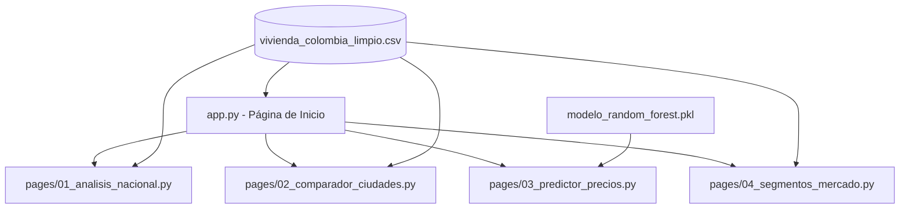

# Fase 6 — Despliegue
## Proyecto: Accesibilidad de Vivienda en Colombia · CRISP-DM 2025-I
**Responsable principal:** Kukis · **Apoyo:** Sofía  
**Estado:** ⏳ Pendiente — requiere modelo y segmentos validados de Fases 4 y 5  
**Semanas:** 10 – 11

> ⚠️ **Aviso de auditoría:** Esta fase **no ha sido ejecutada**. El documento describe la arquitectura planificada, el código de la aplicación a implementar y los requerimientos funcionales. Las secciones de pruebas de funcionalidad y hallazgos están marcadas como `[PENDIENTE]` y deberán completarse tras el despliegue real. No contiene datos inventados ni resultados de pruebas fabricados.

---

## Introducción

La Fase 6 de la metodología CRISP-DM corresponde al Despliegue. En esta etapa final se transformarán los hallazgos y modelos de las fases previas en un **Dashboard Interactivo en Streamlit** accesible públicamente. La aplicación integrará:
- Visualizaciones dinámicas de la evolución temporal del Índice de Accesibilidad Habitacional (IAH).
- Módulos comparativos entre las 12 ciudades focalizadas.
- Predictor de precios usando el pipeline Random Forest de Fase 4.
- Visualización de la segmentación por clústeres de Fase 4.

**Prerrequisitos bloqueantes:**
- `models/modelo_random_forest.pkl` — generado en Fase 4.
- `data/processed/segmentos_mercado.csv` — generado en Fase 4.
- `data/processed/vivienda_colombia_limpio.csv` — versión corregida de Fase 3.
- Criterios de aceptación del modelo verificados en Fase 5.

---

## 1. Requerimientos Funcionales del Dashboard

| ID | Requerimiento Funcional | Descripción | Prioridad | Estado |
|---|---|---|---|---|
| **RF-01** | Panel de Indicadores Clave (KPI) | Mostrar métricas resumen: precio mediano, IAH promedio y ratio cuota/salario. | Alta | ⏳ Pendiente |
| **RF-02** | Filtros Interactivos Laterales | Filtrar por ciudad, rango de años y tipo de propiedad. | Alta | ⏳ Pendiente |
| **RF-03** | Visualización Histórica del IAH | Gráfico de líneas del IAH frente a umbrales OCDE. | Alta | ⏳ Pendiente |
| **RF-04** | Comparador de Ciudades | Contrastar estadísticas de dos o más ciudades. | Media | ⏳ Pendiente |
| **RF-05** | Predictor de Precios Online | Formulario que use el modelo Random Forest para predecir precio en tiempo real. | Alta | ⏳ Pendiente |
| **RF-06** | Mapa de Calor de Segmentos | Visualización de ciudades en los segmentos KMeans de mercado. | Media | ⏳ Pendiente |
| **RF-07** | Semáforo de Asequibilidad | Codificación visual de accesibilidad: Verde / Amarillo / Rojo. | Media | ⏳ Pendiente |
| **RF-08** | Despliegue en la Nube | URL pública en Streamlit Community Cloud. | Alta | ⏳ Pendiente |

---

## 2. Arquitectura de la Aplicación



- **`app/app.py`:** Contenedor principal. Configura el menú lateral, carga datos en caché y muestra KPIs nacionales.
- **`app/pages/01_analisis_nacional.py`:** Evolución macroeconómica y de accesibilidad nacional.
- **`app/pages/02_comparador_ciudades.py`:** Contraste lado a lado de estadísticas entre ciudades.
- **`app/pages/03_predictor_precios.py`:** Interfaz del modelo Random Forest con cálculo de IAH y cuota derivados.
- **`app/pages/04_segmentos_mercado.py`:** Panel del clustering con transición temporal de ciudades.

---

## 3. Código de la Aplicación (Implementación Planificada)

### 3.1 Página Principal (`app/app.py`)

```python
import streamlit as st
import pandas as pd
import numpy as np
import plotly.express as px
import os

st.set_page_config(
    page_title="Accesibilidad de Vivienda en Colombia",
    page_icon="🏠",
    layout="wide",
    initial_sidebar_state="expanded"
)

@st.cache_data
def cargar_datos():
    ruta = "../data/processed/vivienda_colombia_limpio.csv"
    if os.path.exists(ruta):
        return pd.read_csv(ruta)
    else:
        st.error(f"No se encontró el archivo de datos en {ruta}")
        return pd.DataFrame()

df = cargar_datos()

if not df.empty:
    st.sidebar.header("Filtros Generales")
    ciudades_disponibles = sorted(df['city'].unique())
    ciudades_sel = st.sidebar.multiselect("Ciudades", ciudades_disponibles, default=ciudades_disponibles[:3])
    anos_disponibles = sorted(df['year'].unique())
    anos_sel = st.sidebar.slider("Rango de Años", min(anos_disponibles), max(anos_disponibles),
                                  (min(anos_disponibles), max(anos_disponibles)))
    tipos_sel = st.sidebar.multiselect("Tipo de Propiedad", df['property_type'].unique(),
                                        default=list(df['property_type'].unique()))

    df_filtrado = df[
        (df['city'].isin(ciudades_sel)) &
        (df['year'].between(anos_sel[0], anos_sel[1])) &
        (df['property_type'].isin(tipos_sel))
    ]

    col1, col2, col3, col4 = st.columns(4)
    with col1:
        st.metric("Precio Mediano", f"${df_filtrado['price'].median()/1e6:.1f}M COP")
    with col2:
        st.metric("Área Mediana", f"{df_filtrado['area'].median():.1f} m²")
    with col3:
        st.metric("IAH Promedio", f"{df_filtrado['IAH'].mean():.1f} años")
    with col4:
        st.metric("Carga Cuota Hip.", f"{df_filtrado['ratio_cuota_salario'].mean()*100:.1f}%")

    tab1, tab2 = st.tabs(["Evolución del IAH", "Distribución de Precios"])
    with tab1:
        iah_hist = df_filtrado.groupby(['year', 'city'])['IAH'].mean().reset_index()
        fig = px.line(iah_hist, x='year', y='IAH', color='city', markers=True,
                      title="Evolución del IAH por Ciudad")
        fig.add_hline(y=5,  line_dash="dash", line_color="green",  annotation_text="Accesible (PIR ≤ 5)")
        fig.add_hline(y=10, line_dash="dash", line_color="orange", annotation_text="Moderado")
        fig.add_hline(y=20, line_dash="dash", line_color="red",    annotation_text="Crítico (PIR > 20)")
        st.plotly_chart(fig, use_container_width=True)
    with tab2:
        fig2 = px.box(df_filtrado, x='city', y='price', color='property_type',
                      title="Rango de Precios de Venta")
        st.plotly_chart(fig2, use_container_width=True)
```

### 3.2 Análisis Nacional (`app/pages/01_analisis_nacional.py`)

```python
import streamlit as st
import pandas as pd
import plotly.express as px
import os

st.set_page_config(page_title="Análisis Nacional", layout="wide")
st.title("🇨🇴 Comportamiento Macroeconómico Nacional")

ruta = "../data/processed/vivienda_colombia_limpio.csv"
if os.path.exists(ruta):
    df = pd.read_csv(ruta)
    df_nacional = df.groupby('year').agg({
        'price': 'median',
        'IAH': 'mean',
        'tasa_hipotecaria_anual': 'mean',
        'ipc_var_anual': 'mean',
        'salario_mensual': 'first'
    }).reset_index()

    col1, col2 = st.columns(2)
    with col1:
        fig_tasa = px.line(df_nacional, x='year',
                           y=['tasa_hipotecaria_anual', 'ipc_var_anual'],
                           title="Tasa Hipotecaria vs Inflación Anual")
        st.plotly_chart(fig_tasa, use_container_width=True)
    with col2:
        base_price = df_nacional.loc[df_nacional.index[0], 'price']
        base_sal = df_nacional.loc[df_nacional.index[0], 'salario_mensual']
        df_nacional['precio_idx'] = (df_nacional['price'] / base_price) * 100
        df_nacional['salario_idx'] = (df_nacional['salario_mensual'] / base_sal) * 100
        fig_gap = px.line(df_nacional, x='year',
                          y=['precio_idx', 'salario_idx'],
                          title="Índice de Precio vs Salario (Base año inicial = 100)")
        st.plotly_chart(fig_gap, use_container_width=True)
else:
    st.error("Dataset no encontrado. Ejecutar Fase 3 primero.")
```

### 3.3 Comparador de Ciudades (`app/pages/02_comparador_ciudades.py`)

```python
import streamlit as st
import pandas as pd
import plotly.express as px
import os

st.set_page_config(page_title="Comparador", layout="wide")
st.title("📊 Comparador Inmobiliario de Ciudades")

ruta = "../data/processed/vivienda_colombia_limpio.csv"
if os.path.exists(ruta):
    df = pd.read_csv(ruta)
    ciudades = sorted(df['city'].unique())
    col_c1, col_c2 = st.columns(2)
    with col_c1:
        c1 = st.selectbox("Ciudad A", ciudades, index=0)
    with col_c2:
        c2 = st.selectbox("Ciudad B", ciudades, index=1)

    anio_max = df['year'].max()
    df_comp = df[df['city'].isin([c1, c2]) & (df['year'] == anio_max)]

    if not df_comp.empty:
        col_m1, col_m2 = st.columns(2)
        with col_m1:
            st.metric(f"IAH Promedio — {c1}",
                      f"{df_comp[df_comp['city']==c1]['IAH'].mean():.1f} años")
            st.metric(f"Precio m² Mediano — {c1}",
                      f"${df_comp[df_comp['city']==c1]['precio_m2'].median()/1e6:.2f}M COP")
        with col_m2:
            st.metric(f"IAH Promedio — {c2}",
                      f"{df_comp[df_comp['city']==c2]['IAH'].mean():.1f} años")
            st.metric(f"Precio m² Mediano — {c2}",
                      f"${df_comp[df_comp['city']==c2]['precio_m2'].median()/1e6:.2f}M COP")

        fig = px.box(df_comp, x='city', y='ratio_cuota_salario', color='property_type',
                     title=f"Ratio Cuota/Salario por Ciudad — {anio_max}")
        fig.add_hline(y=0.30, line_dash="dash", line_color="red",
                      annotation_text="Límite Accesibilidad (30%)")
        st.plotly_chart(fig, use_container_width=True)
    else:
        st.warning(f"Sin datos disponibles para el año {anio_max}.")
else:
    st.error("Dataset no encontrado. Ejecutar Fase 3 primero.")
```

### 3.4 Predictor de Precios (`app/pages/03_predictor_precios.py`)

```python
import streamlit as st
import pandas as pd
import numpy as np
import joblib
import os

st.set_page_config(page_title="Predictor de Precio", layout="wide")
st.title("🔮 Predicción del Precio y Accesibilidad en Tiempo Real")

@st.cache_resource
def cargar_modelo():
    ruta = "../models/modelo_random_forest.pkl"
    if os.path.exists(ruta):
        return joblib.load(ruta)
    return None

modelo = cargar_modelo()

if modelo is not None:
    st.subheader("Características del Inmueble")

    col1, col2, col3 = st.columns(3)
    with col1:
        area = st.number_input("Área (m²)", min_value=15.0, max_value=800.0, value=70.0)
        property_type = st.selectbox("Tipo", ["Apartamento", "Casa"])
    with col2:
        rooms = st.selectbox("Habitaciones", [1, 2, 3, 4, 5, 6], index=2)
        bathrooms = st.selectbox("Baños", [1, 2, 3, 4, 5, 6], index=1)
    with col3:
        city = st.selectbox("Ciudad", ['Bogotá', 'Medellín', 'Cali', 'Barranquilla', 'Cartagena',
                                        'Bucaramanga', 'Pereira', 'Manizales', 'Armenia',
                                        'Cúcuta', 'Ibagué', 'Villavicencio'])
        estrato = st.slider("Estrato", 1, 6, 3)

    # Variables macro: usar los valores del año más reciente disponible en el dataset
    # [PENDIENTE] — reemplazar con valores reales del año final del dataset corregido
    year_pred       = None  # [PENDIENTE]
    ipc_var         = None  # [PENDIENTE]
    tasa_hip        = None  # [PENDIENTE]
    tasa_desemp     = None  # [PENDIENTE]
    ipvu_var        = None  # [PENDIENTE]
    salario_mensual = None  # [PENDIENTE]

    df_predict = pd.DataFrame([{
        'area': area, 'rooms': rooms, 'bathrooms': bathrooms, 'estrato': estrato,
        'year': year_pred, 'ipc_var_anual': ipc_var,
        'tasa_hipotecaria_anual': tasa_hip, 'tasa_desempleo': tasa_desemp,
        'ipvu_variacion_anual': ipvu_var, 'city': city, 'property_type': property_type
    }])

    if st.button("Calcular Precio Estimado"):
        precio_pred = modelo.predict(df_predict)[0]
        salario_anual = salario_mensual * 12
        iah_estimado = precio_pred / salario_anual
        monto_credito = precio_pred * 0.70
        tasa_mensual = (1 + (tasa_hip / 100)) ** (1/12) - 1
        cuota = monto_credito * (tasa_mensual * (1 + tasa_mensual)**180) / ((1 + tasa_mensual)**180 - 1)
        ratio_cuota = cuota / salario_mensual

        if iah_estimado <= 5 and ratio_cuota <= 0.30:
            color, nivel = "green", "Accesible (cumple estándares OCDE)"
        elif iah_estimado <= 15:
            color, nivel = "orange", "Moderado / Esfuerzo financiero elevado"
        else:
            color, nivel = "red", "🚨 Crítico / Financieramente inviable para salario mínimo"

        st.markdown(f"**Precio estimado:** ${precio_pred:,.0f} COP")
        st.markdown(f"**IAH estimado:** {iah_estimado:.1f} años de salario mínimo")
        st.markdown(f"**Cuota mensual estimada:** ${cuota:,.0f} COP ({ratio_cuota*100:.1f}% del salario)")
        st.markdown(f"**Nivel de accesibilidad:** :{color}[{nivel}]")
else:
    st.error("Modelo no encontrado en `models/modelo_random_forest.pkl`. Ejecutar Fase 4 primero.")
```

### 3.5 Segmentos de Mercado (`app/pages/04_segmentos_mercado.py`)

```python
import streamlit as st
import pandas as pd
import plotly.express as px
import os

st.set_page_config(page_title="Segmentos de Mercado", layout="wide")
st.title("📌 Segmentación de Mercados Inmobiliarios")

ruta = "../data/processed/segmentos_mercado.csv"
if os.path.exists(ruta):
    df_sub = pd.read_csv(ruta)
    col1, col2 = st.columns([2, 1])
    with col1:
        fig = px.scatter(df_sub, x='IAH_promedio', y='ratio_cuota_promedio',
                         color='segmento', hover_name='city', text='city',
                         title="Clustering de Submercados (KMeans)")
        st.plotly_chart(fig, use_container_width=True)
    with col2:
        VARS = ['precio_mediano', 'IAH_promedio', 'ratio_cuota_promedio']
        st.dataframe(df_sub.groupby('segmento')[VARS].mean().round(2))

    st.subheader("Transición Histórica de Segmento por Ciudad")
    pivot = df_sub.pivot(index='city', columns='year', values='segmento')
    st.dataframe(pivot)
else:
    st.warning("Archivo `segmentos_mercado.csv` no encontrado. Ejecutar clustering de Fase 4.")
```

---

## 4. Estilización y Tema

### 4.1 Tema Visual (`.streamlit/config.toml`)

```toml
[theme]
primaryColor = "#3498db"
backgroundColor = "#ffffff"
secondaryBackgroundColor = "#f8f9fa"
textColor = "#2c3e50"
font = "sans serif"
```

### 4.2 Paleta de Colores para Visualizaciones Plotly

- **Accesible:** `#2ecc71` (verde)
- **Moderado:** `#f39c12` (ámbar)
- **Elevado:** `#e67e22` (naranja)
- **Crítico:** `#e74c3c` (rojo)
- **Umbrales de referencia:** `#7f8c8d` (gris neutro)

---

## 5. Configuración del Despliegue

### 5.1 Requisitos de Entorno (`requirements.txt`)

```text
streamlit>=1.25.0
pandas>=1.5.0
numpy>=1.23.0
plotly>=5.15.0
joblib>=1.3.0
scikit-learn>=1.2.0
scipy>=1.10.0
openpyxl>=3.1.0
```

### 5.2 Pasos de Despliegue en Streamlit Community Cloud

1. Crear repositorio en GitHub con la estructura de la sección 6.
2. Subir todos los archivos del proyecto.
3. Iniciar sesión en [share.streamlit.io](https://share.streamlit.io/) y conectar la cuenta de GitHub.
4. Crear nueva app seleccionando el repositorio, rama `main` y archivo de entrada `app/app.py`.
5. Verificar que `requirements.txt` incluye todas las dependencias.
6. Ejecutar el despliegue y registrar la URL pública generada.

**URL del dashboard desplegado:** `[PENDIENTE — completar tras despliegue]`

---

## 6. Estructura Final del Repositorio

```text
proyecto-vivienda-colombia/
├── .streamlit/
│   └── config.toml
├── app/
│   ├── app.py
│   └── pages/
│       ├── 01_analisis_nacional.py
│       ├── 02_comparador_ciudades.py
│       ├── 03_predictor_precios.py
│       └── 04_segmentos_mercado.py
├── data/
│   ├── raw/                          # Datasets fuente (A1–A8, B1–B5)
│   └── processed/
│       ├── vivienda_colombia_limpio.csv
│       └── segmentos_mercado.csv
├── docs/
│   ├── FASE_1_COMPLETA.md
│   ├── FASE_2_COMPLETA.md
│   ├── FASE_3_COMPLETA.md
│   ├── FASE_4_COMPLETA.md
│   ├── FASE_5_COMPLETA.md
│   ├── FASE_6_COMPLETA.md
│   └── figures/
│       ├── 07_feature_importance.png
│       ├── 08_diagnosticos_regresion.png
│       ├── 09_clusters_plot.png
│       └── 10_curva_aprendizaje.png
├── models/
│   └── modelo_random_forest.pkl
├── notebooks/
│   ├── 01_comprension_datos.ipynb
│   ├── 02_preparacion_datos.ipynb
│   ├── 03_modelado.ipynb
│   └── 04_evaluacion.ipynb
├── scripts/
│   └── scraping_fincaraiz_villavicencio.py
├── .gitignore
├── README.md
└── requirements.txt
```

---

## 7. README.md del Repositorio (Plantilla)

```markdown
# Accesibilidad de Vivienda en Colombia · CRISP-DM 2025-I

Proyecto de ciencia de datos que aplica la metodología **CRISP-DM** para estudiar
la evolución del Índice de Accesibilidad Habitacional (IAH) en 12 capitales de
Colombia durante el período 2020–2024.

## Integrantes del Equipo
- **Steve** — Comprensión del Negocio y Modelado
- **Sofía** — Comprensión de los Datos y Evaluación
- **Kukis** — Preparación de Datos y Despliegue

## URL del Dashboard
[PENDIENTE — completar tras despliegue]

## Cómo Ejecutar Localmente

1. Clonar el repositorio:
   ```bash
   git clone https://github.com/[usuario]/proyecto-vivienda-colombia.git
   cd proyecto-vivienda-colombia
   ```
2. Instalar dependencias:
   ```bash
   pip install -r requirements.txt
   ```
3. Iniciar el servidor local:
   ```bash
   streamlit run app/app.py
   ```

## Documentación
La documentación detallada de cada fase CRISP-DM está en `/docs`.
```

---

## 8. Plan de Pruebas de Funcionalidad

> ⚠️ Esta sección se completa **después de ejecutar el despliegue**. No completar con resultados inventados.

| ID | Componente | Acción de Prueba | Comportamiento Esperado | Resultado |
|---|---|---|---|---|
| **TP-01** | Panel de Filtros | Cambiar año y ciudad en sidebar | KPIs y gráficos se actualizan | `[PENDIENTE]` |
| **TP-02** | Predictor Web | Ingresar características válidas y presionar calcular | Devuelve precio predicho e IAH derivado | `[PENDIENTE]` |
| **TP-03** | Manejo de Errores — Predictor | Modelo no disponible (pkl ausente) | Muestra mensaje de error claro | `[PENDIENTE]` |
| **TP-04** | Responsive Mobile | Cargar URL desde dispositivo móvil | Componentes se adaptan al ancho de pantalla | `[PENDIENTE]` |
| **TP-05** | Segmentos — dataset ausente | Acceder a página de segmentos sin CSV | Muestra advertencia clara con instrucción | `[PENDIENTE]` |

---

## 9. Hallazgos de la Fase 6

> ⚠️ Esta sección se completa **después de ejecutar el despliegue** con datos reales.

| ID | Hallazgo Clave | Evidencia | Relevancia |
|---|---|---|---|
| **H6.1** | Tiempo de carga del dashboard | `[PENDIENTE]` | `[PENDIENTE]` |
| **H6.2** | Tiempo de inferencia del predictor | `[PENDIENTE]` | `[PENDIENTE]` |
| **H6.3** | Resultado pruebas funcionales | `[PENDIENTE]` / 5 pruebas superadas | `[PENDIENTE]` |
| **H6.4** | URL pública generada | `[PENDIENTE]` | `[PENDIENTE]` |

---

## 10. Checklist — Fase 6

- [ ] Verificar que los entregables de Fases 4 y 5 existen y son válidos
- [ ] Implementar `app/app.py` y páginas secundarias
- [ ] Crear `.streamlit/config.toml` con tema visual
- [ ] Completar valores `[PENDIENTE]` de variables macro en `03_predictor_precios.py`
- [ ] Verificar `requirements.txt` con todas las dependencias
- [ ] Subir repositorio a GitHub
- [ ] Desplegar en Streamlit Community Cloud y registrar URL
- [ ] Ejecutar plan de pruebas TP-01 a TP-05 y documentar resultados reales
- [ ] Completar sección de hallazgos con datos reales
- [ ] Actualizar README con URL pública
- [ ] Actualizar estado del documento de "Pendiente" a "Completa"

---

## 11. Notas para el Equipo

- **Variables macro del predictor (Kukis):** Los valores de `year_pred`, `ipc_var_anual`, `tasa_hipotecaria_anual`, `tasa_desempleo`, `ipvu_variacion_anual` y `salario_mensual` que se usan en la página del predictor deben extraerse del año más reciente presente en el dataset corregido de Fase 3. No hardcodear valores inventados.
- **Semáforo (Kukis):** Los umbrales de IAH y ratio cuota/salario que activan cada color del semáforo deben derivarse de los umbrales OCDE confirmados en la evaluación real de Fase 5.
- **Demo para presentación:** Preparar el script narrativo de la demo una vez el dashboard esté desplegado y los datos reales confirmados. No escribir precios o IAH específicos de ciudades hasta tener los datos reales.

---

*Documento de Fase 6 · CRISP-DM 2025-I · Proyecto Accesibilidad Habitacional Colombia*  
*Estado: PLANTILLA — completar con datos reales tras ejecutar el despliegue*
